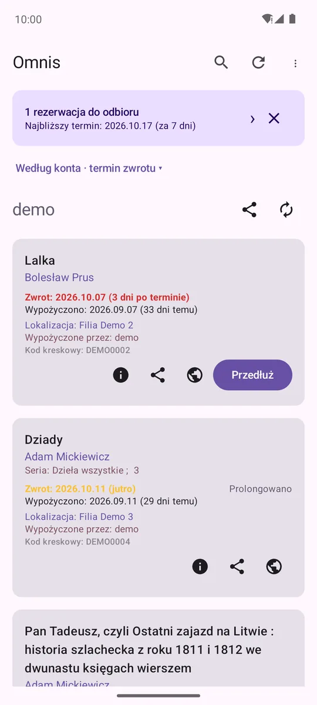
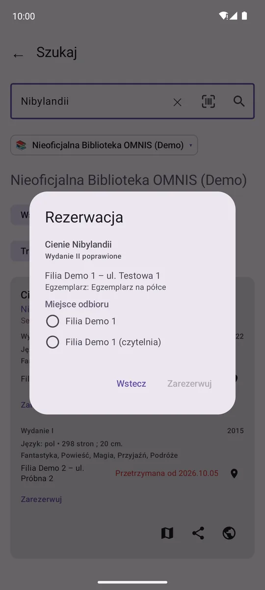
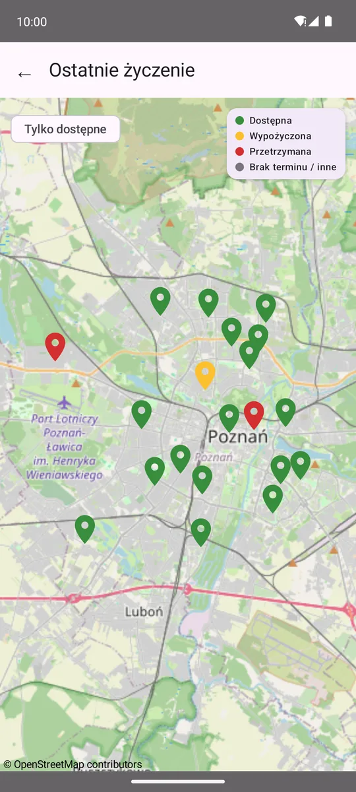

# Omnis Mobile 📚

Nieoficjalna aplikacja na Androida do kont w bibliotekach sieci **OMNIS** i innych korzystających z
systemu **Ex Libris Primo** — Biblioteka Raczyńskich, Biblioteka Narodowa, biblioteki uniwersyteckie
i wiele bibliotek publicznych. Wypożyczenia całej rodziny w jednym miejscu, przedłużanie, rezerwacje
i wyszukiwarka z dostępnością w filiach i mapą.

**Strona projektu:** [theundefined.github.io/omnis-mobile](https://theundefined.github.io/omnis-mobile/) ·
**[Dołącz do testów](https://theundefined.github.io/omnis-mobile/#testy)** ·
[Polityka prywatności](https://theundefined.github.io/omnis-mobile/privacy.html)

<p>
<picture><source srcset="docs/img/dark/01_loans.webp" media="(prefers-color-scheme: dark)"></picture>
<picture><source srcset="docs/img/dark/07_place_hold.webp" media="(prefers-color-scheme: dark)"></picture>
<picture><source srcset="docs/img/dark/10_branch_map.webp" media="(prefers-color-scheme: dark)"></picture>
<picture><source srcset="docs/img/dark/04_holds.webp" media="(prefers-color-scheme: dark)"></picture>
</p>

Aplikacja nie jest związana z Ex Libris, siecią OMNIS ani żadną biblioteką. Łączy się bezpośrednio
z serwerem wybranej biblioteki — autor nie prowadzi żadnego serwera pośredniczącego.

## ✨ Funkcje

**Wypożyczenia**
- Wiele kont w wielu bibliotekach naraz, z możliwością tymczasowego wyłączenia konta.
- Kolorowe terminy zwrotu, grupowanie według osoby lub filii, kilka sposobów sortowania.
- Przedłużanie pojedynczej książki albo całej grupy naraz.
- Szczegóły wypożyczenia (sygnatura, kategoria, powód braku możliwości przedłużenia), adres filii
  z nawigacją, udostępnianie.
- Historia wypożyczeń doczytywana stronami i zapamiętywana na telefonie.

**Wyszukiwarka** — anonimowa, działa bez konta w danej bibliotece
- Dowolna z 55 obsługiwanych bibliotek, także kilka naraz.
- Wszystkie wydania tytułu, dostępność w każdej filii i termin zwrotu wypożyczonych egzemplarzy.
- Filtr typu (książka, audiobook, film…), preferowane filie, sortowanie po trafności, tytule i serii.
- Wyszukiwanie po autorze i serii (także prosto z listy wypożyczeń), historia wyszukiwań.
- Mapa filii (OpenStreetMap) i skaner kodu ISBN z aparatu, również jako skrót aplikacji.

**Rezerwacje i karta**
- Rezerwacja z wyników wyszukiwania z wyborem filii i miejsca odbioru.
- Lista rezerwacji wszystkich kont, anulowanie, baner „do odbioru” z terminem odbioru.
- Karta biblioteczna z kodem kreskowym (Code 128).

**Pozostałe**
- Tryb demo z przykładowym kontem — do obejrzenia aplikacji bez konta w bibliotece.
- Polski i angielski, jasny i ciemny motyw, autouzupełnianie haseł.
- Dane logowania szyfrowane na telefonie (`EncryptedSharedPreferences`, klucz w Android Keystore).

## 🏛️ Obsługiwane biblioteki

55 bibliotek w polskiej sieci OMNIS i innych instalacjach Primo. Pełna lista:
[`Tenants.kt`](app/src/main/kotlin/com/theundefined/omnis/data/model/Tenants.kt). Nowa biblioteka to
zwykle jeden wpis w tej liście — [zgłoś](https://github.com/theundefined/omnis-mobile/issues), jeśli
brakuje Twojej. Bibliotekę spoza listy (katalog Primo VE z logowaniem loginem i hasłem) można też dodać
samodzielnie w aplikacji, wklejając link do jej katalogu (z parametrem `vid=`).

## 🧪 Testy w Google Play

Aplikacja jest testowana w Google Play przed publicznym wydaniem. Jak dołączyć — na
[stronie projektu](https://theundefined.github.io/omnis-mobile/#testy). Gotowe pliki APK są też
dołączane do każdego [wydania na GitHubie](https://github.com/theundefined/omnis-mobile/releases).

## 🛠️ Technologia

- Kotlin, Jetpack Compose (Material 3), MVVM + Kotlin Flow
- Retrofit + OkHttp, kotlinx.serialization / Gson
- osmdroid (mapa), Google code scanner (ISBN), Sentry (raporty błędów)
- JDK 21, AGP 8.10.1, compileSdk/targetSdk 36, minSdk 26

Logika API Primo pochodzi z biblioteki [omnis-py](https://github.com/theundefined/omnis-py) (ta sama
funkcjonalność w Pythonie, z narzędziem wiersza poleceń).

## 🚀 Budowanie i wydania

```bash
./gradlew assembleDebug   # APK debug
./gradlew test            # testy jednostkowe
```

Wydania są w pełni automatyczne: `./release.sh patch|minor|major` podnosi wersję i wypycha commit
`release: vX.Y.Z` na `main`, a GitHub Actions buduje i podpisuje APK/AAB, uruchamia testy UI na
emulatorze (konto demo), tworzy tag i wydanie na GitHubie oraz publikuje wersję w Google Play (ścieżka
testów wewnętrznych).

Zrzuty ekranu na stronę projektu robi ręcznie uruchamiany workflow
[`screenshots.yml`](.github/workflows/screenshots.yml) (`gh workflow run screenshots.yml`); wynik trafia
jako artefakt do przejrzenia, a wybrane pliki — do [`docs/img/`](docs/img/).

## 🤝 Autor

[TheUndefined](https://github.com/theundefined). Uwagi i błędy:
[issues](https://github.com/theundefined/omnis-mobile/issues).
